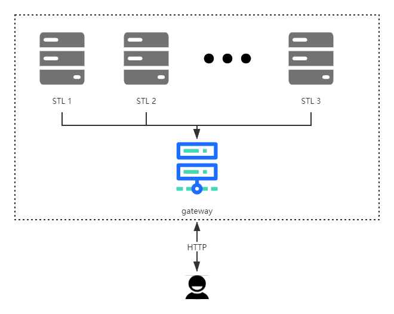

# QLite [[English Document](./README_EN.md)]
QLite 是基于微服务的 NewSQL 型数据库系统，与传统的一体化数据库不同，该系统将本该内置的多种数据结构（STL）拆分成多个服务模块，每个模块都是独立的一个节点，每个节点都与其主网关进行连接，从而形成分布式存储结构。

QLite 主要存储方式为KV存储，主网关内置Hash结构，如同关系型数据报表，可存储已加载（连接）至主网关的所有数据结构。
> Hash结构可以存储Hash本身。这就导致QLite 数据库可以像文件夹一样进行树状查找及存储操作。

该系统配有轻量级 QLite - STL 开发框架，可以将自己编写的数据结构与QLite进行连接，具有高扩展性，但目前该框架只支持Go语言，具体见 [go-qlite](https://www.github.com/culion-bear/go-qlite)。

## Background

QLite 在发布至GitHub前已经经历了两个版本，分别是TCP版和集成版，效果皆不是很理想，该版本为分布式版本，采用HTTP作为接口交互协议，将信息处理完全交给了应用层，在损失了一定的性能的前提下提高了扩展性和复用性，更方便从业人员进行数据处理。

## Change Log

### V 2.1.1
- 解决了服务模块重连失败但未报错的BUG
- 优化了网关启动时服务连接操作，将连接失败时是否重连的选择权交给了使用者，而不是直接取消启动

### V 2.0.2
- 优化了优雅关闭服务（Ctrl+C）,解决关闭服务时数据不能及时存储至本地的BUG
- 优化了版本信息

## Feature

- 插件化集成：一种数据结构为一个模块，可随意注册至网关
- 提供Go语言版本的STL开发框架，可进行自定义开发
- 将Hash结构作为网关内置结构，等同于操作系统中的文件夹
- 存储模式选用KV型存储方案，在Hash结构的支持下，使数据间的关系不再混乱。

## Architecture



## Install

[linux-amd64-latest](https://github.com/culion-bear/qlite/releases/download/v2.1.1/qlite-linux-amd64)

[linux-arm64-latest](https://github.com/culion-bear/qlite/releases/download/v2.1.1/qlite-linux-arm64)

[windows-2.0.1-BETA](https://github.com/culion-bear/qlite/releases/download/v2.0.1-beta/qlite-windows.exe)

## Usage

```shell script
windows
qlite.exe -f [yaml path]
```

```shell script
linux
chmod 777 qlite
./qlite -f [yaml path]
```

[[click to download yaml file](./qlite.yaml)]

## Related Efforts

- STL
    - [qlite-string](https://github.com/culion-bear/qlite-stl-string)

- Other
    - [go-qlite](https://github.com/culion-bear/go-qlite)

## 快速开始

[API文档](./doc/api.md)

## 作者有话说

这个项目目前处于测试阶段，BUG肯定是有的，优化的方面也肯定有很多，希望感兴趣的兄弟们可以一起完善这个项目。如果您有更好的点子可以反馈给我，我会及时查阅的。